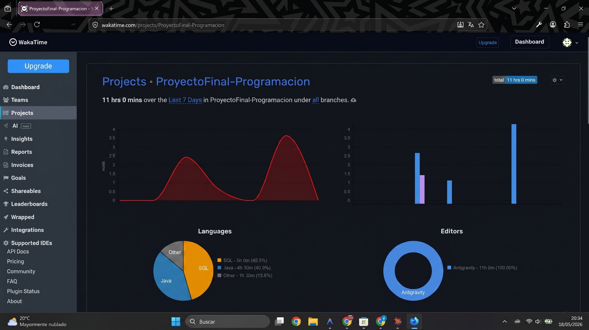

# Sistema de Gestión de Gimnasio con IA Coach

**Proyecto Final — Programación · 1.º DAW**  
**Centro:** IES Francisco Ayala · Granada  
**Alumno:** Álvaro Pleguezuelos Salcedo 
**Curso académico:** 1º DAW 2026  
**Tecnologías:** Java 17 · Swing · JDBC · MySQL 8 · MVC · DAO Pattern

---

## Tabla de Contenidos

1. [Descripción General](#1-descripción-general)
2. [Arquitectura y Estructura del Proyecto](#2-arquitectura-y-estructura-del-proyecto)
3. [Modelo de Base de Datos](#3-modelo-de-base-de-datos)
4. [Instrucciones de Instalación y Ejecución](#4-instrucciones-de-instalación-y-ejecución)
5. [Manual de Uso](#5-manual-de-uso)
6. [Control de Versiones y Registro de Actividad](#6-control-de-versiones-y-registro-de-actividad)

---

## 1. Descripción General

El **Sistema de Gestión de Gimnasio con IA Coach** es una aplicación de escritorio desarrollada en Java con interfaz gráfica Swing. El sistema permite administrar de forma integral los clientes de un gimnasio, sus inscripciones a clases y sus datos físicos, presentando toda la información en un panel de control (Dashboard) profesional.

### Funcionalidad estrella — Coach Virtual de IA

La característica diferenciadora del sistema es el **Coach Virtual de Inteligencia Artificial**, implementado en la clase `service/CoachService.java`. A partir de los datos físicos reales de cada cliente almacenados en la base de datos (peso, altura, género, edad calculada a partir de la fecha de nacimiento y objetivo fitness), el sistema construye un **prompt estructurado de calidad profesional** diseñado para ser enviado a cualquier modelo de lenguaje grande (LLM) como ChatGPT o Gemini.

El prompt generado actúa como un entrenador personal digital: especifica el perfil completo del cliente, solicita un plan de entrenamiento semanal adaptado a sus características físicas, e incluye recomendaciones sobre frecuencia cardíaca, grupos musculares por sesión y consideraciones de salud articular en función del índice peso/altura del cliente. Esta funcionalidad es accesible directamente desde el Dashboard seleccionando cualquier cliente de la tabla y pulsando el botón **🤖 Generar Rutina IA**.

---

## 2. Arquitectura y Estructura del Proyecto

El proyecto sigue rigurosamente la arquitectura **MVC (Model-View-Controller)** combinada con el **patrón de diseño DAO (Data Access Object)** para garantizar el desacoplamiento total entre la lógica de negocio, el acceso a datos y la interfaz de usuario.

```
ProyectoFinal/
│
├── src/
│   ├── Main.java                   # Punto de entrada. Configura Metal L&F e inicia el Login.
│   │
│   ├── db/
│   │   └── ConexionDB.java         # Gestión centralizada de la conexión JDBC a MySQL.
│   │
│   ├── model/                      # CAPA MODELO — Entidades de negocio (POJOs)
│   │   ├── Usuario.java            # Entidad base con los atributos comunes.
│   │   ├── Cliente.java            # Extiende Usuario; añade datos físicos y fitness.
│   │   └── Clase.java              # Entidad que representa una clase del gimnasio.
│   │
│   ├── dao/                        # CAPA DE ACCESO A DATOS — Patrón DAO
│   │   ├── UsuarioDAO.java         # Interfaz que define el contrato CRUD + registrar().
│   │   ├── UsuarioDAOImpl.java     # Implementación JDBC con transacciones manuales.
│   │   ├── ClienteDAOImpl.java     # Actualización de datos físicos del cliente.
│   │   ├── ClaseDAOImpl.java       # Operaciones CRUD sobre la tabla clases.
│   │   └── InscripcionDAOImpl.java # JOIN entre usuarios, clientes e inscripciones.
│   │
│   ├── dto/                        # CAPA DTO — Objetos de transferencia de datos
│   │   ├── ClienteDetalleDTO.java  # Proyección plana con fecha_nacimiento para la IA.
│   │   └── InscripcionDTO.java     # Datos agregados de una inscripción concreta.
│   │
│   ├── service/                    # CAPA DE SERVICIO — Lógica de negocio
│   │   └── CoachService.java       # Motor del Coach IA: genera prompts personalizados.
│   │
│   └── view/                       # CAPA VISTA — Interfaz gráfica Swing
│       ├── Login.java              # Autenticación con enrutado por rol.
│       ├── Principal.java          # Dashboard ADMIN: tabla de clientes y gestión completa.
│       ├── ClienteDashboard.java   # Panel CLIENTE: solo sus propios datos y acciones.
│       ├── PerfilDialog.java       # Diálogo modal: editar perfil e inscribirse en clase.
│       └── Registro.java           # Diálogo modal de alta de nuevos usuarios/clientes.
│
├── lib/
│   └── mysql-connector-j-8.3.0.jar # Driver JDBC oficial de MySQL.
│
├── bin/                            # Bytecode compilado (.class). Generado por javac.
├── ejecutar.bat                    # Script de compilación y lanzamiento con doble clic.
├── gimnasio_db.sql                 # Script DDL completo para inicializar la base de datos.
└── documentacion/
    ├── README.md                   # Este archivo.
    └── capwakatime.png             # Captura del panel de WakaTime.
```

### Decisiones de diseño destacadas

| Decisión | Justificación técnica |
|---|---|
| **Interfaz `UsuarioDAO`** | Permite sustituir `UsuarioDAOImpl` por otra implementación (ej. con Hibernate) sin modificar ninguna vista. Principio de inversión de dependencias. |
| **DTO `ClienteDetalleDTO`** | Evita exponer entidades de dominio a la capa de presentación y optimiza la consulta SQL con un `JOIN` específico en lugar de múltiples llamadas al DAO. |
| **Transacción manual en `registrar()`** | El registro de un cliente implica dos `INSERT` atómicos (`usuarios` + `clientes`). Se usa `conn.setAutoCommit(false)` y `conn.commit()` / `conn.rollback()` para garantizar la integridad referencial. |
| **`CoachService` desacoplado** | El servicio recibe un objeto `Cliente` y devuelve un `String`, sin ninguna dependencia con Swing. Puede probarse de forma unitaria y reutilizarse en futuras interfaces web. |
| **Control de acceso por rol** | El `Login` inspecciona el campo `rol` del `Usuario` autenticado y enruta a `Principal` (ADMIN) o `ClienteDashboard` (CLIENTE), garantizando que cada perfil solo accede a su propia información. |
| **`ClienteDAOImpl` independiente** | Las operaciones de actualización de datos físicos se encapsulan en su propio DAO, respetando el principio de responsabilidad única y facilitando la extensión futura. |
| **`MetalLookAndFeel`** | El L&F nativo de Windows ignora `setBackground/setForeground` en botones. Se usa el L&F Metal de Java para garantizar que los colores de la interfaz se respeten en cualquier entorno. |

---

## 3. Modelo de Base de Datos

La base de datos `gimnasio_db` implementa un esquema relacional con **herencia de tabla unida (Joined Table Inheritance)**, patrón habitual en ORM como JPA/Hibernate, aquí aplicado manualmente sobre JDBC.

### Diagrama Entidad-Relación

```
┌─────────────────────────────────┐        ┌────────────────────────────────────┐
│           usuarios              │        │             clientes               │
├─────────────────────────────────┤        ├────────────────────────────────────┤
│ id           INT   PK  AUTO_INC │◄───────│ id               INT   PK  FK      │
│ username     VARCHAR(50)  UNIQUE│        │ objetivo_fitness  VARCHAR(100)      │
│ password     VARCHAR(255)       │        │ peso_inicial      DECIMAL(5,2)      │
│ email        VARCHAR(100) UNIQUE│        │ altura            INT               │
│ nombre       VARCHAR(100)       │        │ fecha_nacimiento  DATE              │
│ apellidos    VARCHAR(100)       │        │ genero            VARCHAR(20)       │
│ dni          VARCHAR(20)  UNIQUE│        └───────────────────┬────────────────┘
│ rol          ENUM(CLIENTE,ADMIN)│                            │ ON DELETE CASCADE
└─────────────────────────────────┘                            │
                                                               │ 1
                                               ┌───────────────▼────────────────┐
                                               │          inscripciones          │
                                               ├─────────────────────────────────┤
                                               │ id               INT  PK        │
                                               │ cliente_id       INT  FK ───────┼──► clientes(id)
                                               │ clase_id         INT  FK ───────┼──► clases(id)
                                               │ fecha_inscripcion DATE          │
                                               └─────────────────────────────────┘
                                                                │
                                                    ┌───────────▼──────────────┐
                                                    │          clases           │
                                                    ├──────────────────────────┤
                                                    │ id          INT  PK       │
                                                    │ nombre      VARCHAR(100)  │
                                                    │ descripcion TEXT          │
                                                    │ aforo_max   INT           │
                                                    └──────────────────────────┘
```

### Descripción de tablas

**`usuarios`** — Tabla raíz que almacena las credenciales y datos personales de todos los actores del sistema (clientes y administradores). El campo `rol` es un `ENUM` con los valores `CLIENTE` y `ADMIN`.

**`clientes`** — Implementa la herencia mediante una relación 1 a 1 con `usuarios`. Su clave primaria `id` es simultáneamente una clave foránea que apunta a `usuarios(id)`. La cláusula `ON DELETE CASCADE` garantiza que al eliminar un registro de `usuarios`, su fila correspondiente en `clientes` se elimina automáticamente, preservando la integridad referencial sin intervención manual.

**`clases`** — Catálogo de actividades del gimnasio con nombre, descripción y aforo máximo.

**`inscripciones`** — Tabla de unión N:M entre `clientes` y `clases`. Registra la fecha de inscripción de cada cliente a cada clase. Las dos claves foráneas con `ON DELETE CASCADE` aseguran que las inscripciones huérfanas sean eliminadas automáticamente si se borra un cliente o una clase.

### Consulta JOIN del Dashboard

El Dashboard se nutre de una única consulta optimizada con subconsulta correlacionada para obtener la última clase de cada cliente sin realizar múltiples roundtrips a la base de datos:

```sql
SELECT
    u.id,
    CONCAT(u.nombre, ' ', u.apellidos) AS nombreCompleto,
    u.dni,
    c.objetivo_fitness,
    c.peso_inicial,
    c.altura,
    c.genero,
    (
        SELECT cl.nombre
        FROM inscripciones i
        JOIN clases cl ON i.clase_id = cl.id
        WHERE i.cliente_id = c.id
        ORDER BY i.fecha_inscripcion DESC
        LIMIT 1
    ) AS ultimaClase
FROM usuarios u
JOIN clientes c ON u.id = c.id;
```

---

## 4. Instrucciones de Instalación y Ejecución

### Requisitos previos

| Componente | Versión mínima | Notas |
|---|---|---|
| JDK | 17 | Necesario para compilar y ejecutar |
| MySQL Server | 8.0 | Debe estar en ejecución local en el puerto 3306 |
| MySQL Workbench | Cualquiera | Para ejecutar el script DDL |
| Git | Cualquiera | Para clonar el repositorio |

### Paso 1 — Clonar el repositorio

```bash
git clone https://github.com/aps-bulletcode/ProyectoFinal-Programacion.git
cd ProyectoFinal-Programacion
```

> También puedes descargar el ZIP directamente desde GitHub → **Code → Download ZIP**.

### Paso 2 — Inicializar la base de datos

Abre **MySQL Workbench**, conéctate al servidor local (`root@localhost:3306`) y ejecuta el script completo:

```
Archivo → Open SQL Script → selecciona gimnasio_db.sql → Ejecutar (Ctrl+Shift+Enter)
```

El script crea la base de datos `gimnasio_db`, todas las tablas con sus claves foráneas y un conjunto de datos de prueba para las clases disponibles.

### Paso 3 — Verificar credenciales de conexión

Abre el archivo `src/db/ConexionDB.java` y confirma que los parámetros coinciden con tu instalación de MySQL:

```java
private static final String URL  = "jdbc:mysql://localhost:3306/gimnasio_db";
private static final String USER = "root";
private static final String PASS = "BaseDeDatos";   // ← ajustar si difiere
```

### Paso 4 — Compilar el proyecto

Desde la raíz del proyecto, ejecuta en la terminal (PowerShell o CMD):

```powershell
javac -encoding UTF-8 -cp "lib\mysql-connector-j-8.3.0.jar" -d bin `
    src\model\*.java src\db\*.java src\dto\*.java `
    src\dao\*.java src\service\*.java src\view\*.java src\Main.java
```

### Paso 5 — Ejecutar la aplicación

**Opción A — Doble clic (recomendada):**

Haz doble clic en `ejecutar.bat` desde el Explorador de Windows. El script compila y lanza la app automáticamente.

**Opción B — Terminal manual:**

```powershell
java -cp "bin;lib\mysql-connector-j-8.3.0.jar" Main
```

La aplicación arrancará mostrando la ventana de **Inicio de Sesión**.

---

## 5. Manual de Uso

### Flujo según rol

```
                    ┌─────────────────────────────────────┐
                    │             Login                   │
                    └──────┬──────────────┬───────────────┘
                     ADMIN │              │ CLIENTE
                           ▼              ▼
              ┌────────────────┐   ┌─────────────────────┐
              │  Principal     │   │  ClienteDashboard    │
              │  (Dashboard    │   │  (solo mis datos)    │
              │   completo)    │   └──────────┬──────────┘
              └───────┬────────┘              │
                      │              ┌────────┴─────────┐
              Gestión de todos       │  PerfilDialog    │
              los clientes           │  Editar perfil   │
                                     │  Inscribir clase │
                                     └──────────────────┘
```

### Panel del Administrador (rol ADMIN)

1. Tabla con todos los clientes registrados (ID, Nombre, DNI, Objetivo, Última clase).
2. **＋ Nuevo** — registrar un nuevo cliente o administrador.
3. **✏️ Ver / Editar** — abre `PerfilDialog` con los datos del cliente seleccionado. Permite modificar objetivo, peso, altura y género, e inscribirle en una clase.
4. **🗑️ Eliminar** — elimina el cliente seleccionado con confirmación (CASCADE en BD).
5. **🤖 Generar Rutina IA** — genera un prompt de entrenamiento personalizado basado en los datos físicos del cliente.

### Panel del Cliente (rol CLIENTE)

Al iniciar sesión, el cliente accede a su **panel personal** donde solo ve sus propios datos:

| Botón | Acción |
|---|---|
| ✏️ Editar mis datos | Modifica objetivo fitness, peso, altura y género |
| 📋 Inscribirme en clase | Selecciona una clase disponible y se inscribe |
| 🤖 Mi Rutina IA | Genera un prompt de entrenamiento personalizado con sus datos reales |
| 🚪 Cerrar sesión | Vuelve a la pantalla de Login |

### Registro de un nuevo cliente

1. En la pantalla de Login, pulsar **"¿No tienes cuenta? Registrarse"**.
2. Seleccionar el rol **CLIENTE** en el desplegable — aparecerán automáticamente los campos físicos.
3. Rellenar todos los campos marcados con `*`:

| Campo | Formato esperado | Ejemplo |
|---|---|---|
| Usuario | Texto sin espacios | `carlos123` |
| Contraseña | Texto libre | `Gym2024!` |
| Email | Dirección con `@` | `carlos@gmail.com` |
| DNI | 8 dígitos + letra | `12345678A` |
| Peso | Número decimal (punto o coma) | `75` o `75.5` |
| Altura | Número entero (centímetros) | `178` |
| Fecha de nacimiento | `dd/MM/yyyy` | `15/03/1995` |

4. Pulsar **Guardar**. Si el registro es exitoso, la tabla del Dashboard se actualiza automáticamente.

### Generar Rutina IA

1. Desde el Dashboard (ADMIN) o el panel personal (CLIENTE), pulsa **🤖 Generar Rutina IA** / **🤖 Mi Rutina IA**.
2. Se mostrará un prompt profesional listo para copiar y pegar en ChatGPT, Gemini o cualquier LLM.
3. El prompt incluye: nombre, edad real (calculada desde fecha de nacimiento), género, peso, altura y objetivo fitness.

---

## 6. Control de Versiones y Registro de Actividad

### GitHub — Estrategia de volcado

El historial de commits en GitHub refleja un volcado concentrado hacia el final del desarrollo. Esta decisión fue deliberada y técnicamente justificada:

Durante las fases iniciales del proyecto se priorizó la **estabilidad del entorno de desarrollo local** y la consolidación progresiva de la arquitectura MVC. Realizar commits parciales con código incompleto (DAOs sin implementar, vistas sin conectar, transacciones sin validar) habría comprometido la coherencia del historial y dificultado la revisión del proyecto como unidad funcional.

Una vez completada e integrada la pila completa —modelo de datos, capa DAO con transacciones atómicas, servicios, vistas Swing y flujo de datos end-to-end—, se procedió al volcado estructurado al repositorio remoto. Este enfoque garantiza que cada commit representa un **estado funcional y verificable** del sistema, alineándose con las buenas prácticas de entrega de proyectos académicos.

### WakaTime — Nota sobre el registro de horas

El tiempo de desarrollo registrado por **WakaTime** puede presentar discrepancias respecto al esfuerzo real invertido en el proyecto. Estas diferencias se deben a problemas de sincronización del plugin con el IDE utilizado: en determinadas sesiones de trabajo el plugin no inició correctamente o perdió la conexión con el servicio, dejando intervalos de actividad sin registrar.



El esfuerzo real comprende el diseño e implementación de la arquitectura MVC completa, la configuración del entorno JDBC, el desarrollo de cinco vistas Swing con lógica de validación, la implementación de transacciones manuales en el DAO, el diseño del esquema relacional con herencia de tabla unida y la integración del módulo de IA. Este conjunto de tareas representa un volumen de trabajo significativamente superior al que podría inferirse de las estadísticas de WakaTime.

---

## Licencia y uso académico

Este proyecto ha sido desarrollado con fines exclusivamente académicos como trabajo final de la asignatura de Programación del ciclo formativo de grado superior **Desarrollo de Aplicaciones Web (DAW)** en el **IES Francisco Ayala de Granada**. Queda prohibida su reproducción total o parcial con fines comerciales sin autorización expresa del autor.

---

*Documentación generada el 18 de mayo de 2026.*
